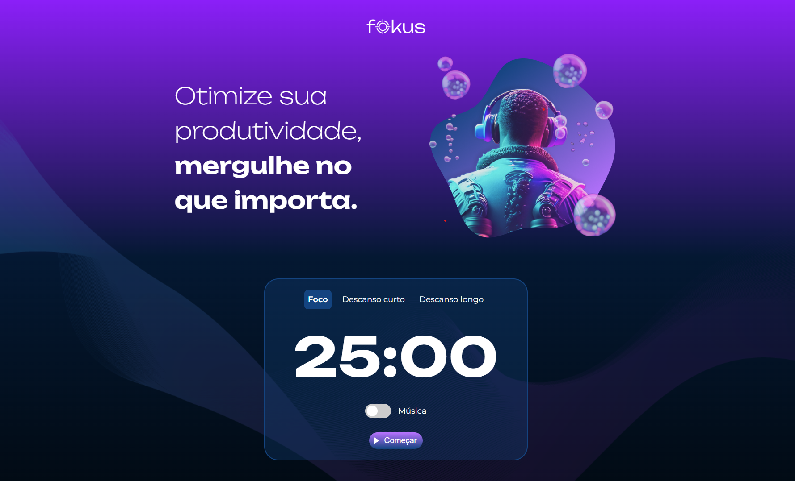



# Fokus
O Projeto Fokus é uma aplicação web inspirada na técnica de produtividade Pomodoro, que consiste em alternar períodos de trabalho focado com pequenas pausas para descanso. Com o Projeto Fokus, você pode otimizar sua rotina de trabalho, gerenciando seu tempo de forma eficiente e mantendo o foco nas tarefas mais importantes.

## Introdução
A aplicação oferece três contextos principais para o usuário escolher: foco, descanso curto e descanso longo. Cada um desses contextos tem uma duração pré-definida, e o aplicativo realiza uma contagem regressiva visual e sonora para indicar o tempo restante em cada etapa.

## Recursos do Projeto:
- Contador regressivo para foco e pausas
- Notificações sonoras para início, pausa e fim do tempo
- Interface dinâmica que muda com base no contexto selecionado
- Funcionalidade de iniciar, pausar e reiniciar a contagem regressiva

Com o Projeto Fokus, você pode melhorar sua produtividade, manter o equilíbrio entre trabalho e descanso e alcançar seus objetivos de forma mais eficiente. Experimente agora e mergulhe no que realmente importa!

### 📦 Tecnologias usadas
* [HTML](https://developer.mozilla.org/pt-BR/docs/Web/HTML)
* [CSS](https://developer.mozilla.org/pt-BR/docs/Web/CSS)
* [JavaScript](https://developer.mozilla.org/pt-BR/docs/Web/JavaScript)

### 👷‍♂️ Autores / Colaboradores

* **Luan Alves** - *Instrutor Frontend do projeto* - [@luan-alvesdev](https://github.com/luan-alvesdev)

* **Arthur Cavalcante** - *Frontend do projeto* - [@Thurcavalcante](https://github.com/Thurcavalcante)

### 🔗 Deploy: [Fokus](https://alura-fokus-nu-six.vercel.app/)
